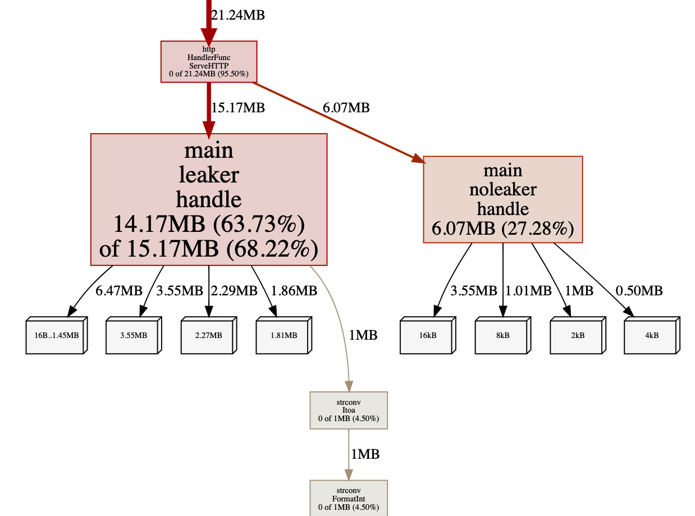
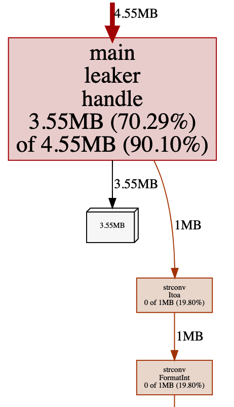

# Memory profile

## Attack

- Run:
> `go run main.go -repetitions 1000`

> `cat mem.http | vegeta attack -duration=5s -rate=100 | vegeta report`

- After `attack` is finished run:
> `go tool pprof -http=:7070 http://localhost:8080/debug/pprof/heap`

## Memory analysis

Before you read on, remember that your graphs can differ slightly from those presented here.
For example if you hit a moment of GC you can catch that in your graphs.
Sometimes I was also able to see pprof serving heap dump request.

### Alloc space

Select `Sample->alloc_space` and `View->Graph`

`alloc_space` shows total space (number of bytes) allocated since the beginning of the program.
The graph shows two main sources of allocation - `leaker.handle` and `noleaker.handle`.
From the graph we can read two interesting things:

- gray boxes with Megabytes specified show who keeps (or was keeping) those bytes
- brown'ish arrow pointing `strconv.Itoa` shows where and how those bytes were allocated

### Inuse space

Select `Sample->inuse_space` and `View->Graph`

`inuse_space` show total space allocated and not freed yet.
This graph shows only one source of allocation - as expected our `leaker.handle` is here.

Now go to `View->Source`.

You can see those pieces of code responsible for allocations. There is one small
problem though - I can see here more than I wanted too.
For example I have on the list `compress/flate.newHuffmanEncoder` or `net/http.(*conn).serve`.
Since I have already decided that I am interested in `leaker.handle` I want to focus
my analysis on that.

Go to `View->Graph` again, select block with `main.leaker.handle` (yes, graph is clickable).
Now from menu `Refine->Focus` or `Refine->Show from`. From now on, all other views
are narrowed down to our "suspicious" code.

## Trace

We can also observe what our program is doing and how much GC was involved using trace.

Run simultaneously:

> `cat mem.http | vegeta attack -duration=30s -rate=100 | vegeta report`
>
> `wget http://localhost:8080/debug/pprof/trace?seconds=30 -O trace.out`

Then run `go tool trace trace.out`.

**TODO**
